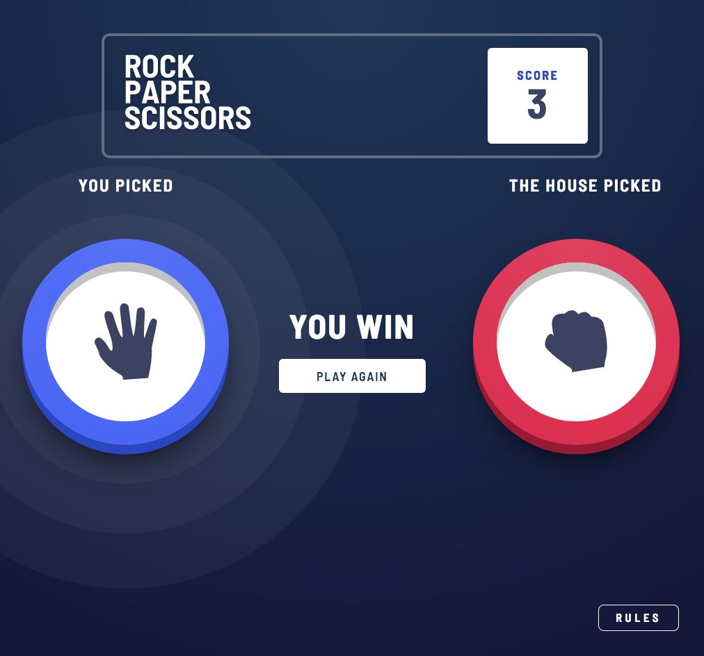

# Frontend Mentor - Rock, Paper, Scissors Solution

This is a solution to the [Rock, Paper, Scissors challenge on Frontend Mentor](https://www.frontendmentor.io/challenges/rock-paper-scissors-game-pTgwgvgH). Frontend Mentor challenges help you improve your coding skills by building realistic projects. 

## Table of Contents

- [Overview](#overview)
  - [The challenge](#the-challenge)
  - [Screenshot](#screenshot)
  - [Links](#links)
- [My process](#my-process)
  - [Built with](#built-with)
  - [What I learned](#what-i-learned)
  - [Continued development](#continued-development)
- [Author](#author)

## Overview

### The Challenge

Users should be able to:

- View the optimal layout for the game depending on their device's screen size
- Play Rock, Paper, Scissors against the computer
- Maintain the state of the score after refreshing the browser _(optional)_
- **Bonus**: Play Rock, Paper, Scissors, Lizard, Spock against the computer _(optional)_

### Screenshot

### Links

- Solution URL: [https://www.frontendmentor.io/solutions/rock-paper-scissors-game-with-javascript-and-css-class-toggling-CpNFmb8Hw](https://www.frontendmentor.io/solutions/rock-paper-scissors-game-with-javascript-and-css-class-toggling-CpNFmb8Hw)
- Live Site URL: [https://nisenihonjin.github.io/rock-paper-scissors-game/](https://nisenihonjin.github.io/rock-paper-scissors-game/)

## My Process

### Built With

- Semantic HTML5 markup
- Basic assessibility functionality
- CSS custom properties
- CSS Grid / Transitions / Animations
- Mobile-first workflow
- Javascript

### What I Learned

This was a fun challenge to create a sort of "game" through HTML, CSS, and JavaScript. I decided to use a lot of smooth animations and such since I felt it led to the best user experience with this type of interaction. Therefore, I went with using a lot of animations/transitions between different states of the "game" and adding/removing CSS classes to facilitate the transitions. However, because of that, my CSS file is very big, and, while I tried to organize it a little, it still has many very specific rules and many high specificity selectors in it.

I did use a fair amount of JavaScript as well to handle score, game mode, and more, but mostly it does a lot of adding/removing of CSS classes. You can switch between the two "normal" and "bonus" game modes by clicking on the header logo image. However, you can't do this in the middle or a round; you must do it before you've selected a "token" for it to work.

This was my first time working heavily with SVGs and getting them to resize. While not the same as images, I made use of the `viewBox` attribute within the SVGs in order to get them to resize fairly effortlessly.

### Continued Development

I dabbled a little bit into accessibility for this project, but not a lot. Since it is fairly interactive, I felt it should be fairly accessible, but after coding the innerworkings of the "game," I decided I should leave that for another project.

The SVGs in Safari get blurred due to scaling, and I couldn't really find a satifying solution. I could spend time finding a solution, but I feel that by the time I've found one, browser support will have caught up, and it won't be necessary anymore.

## Author

- Website - [Aaron Romanick](https://www.aaronromanick.com)
- Frontend Mentor - [@nisenihonjin](https://www.frontendmentor.io/profile/nisenihonjin)